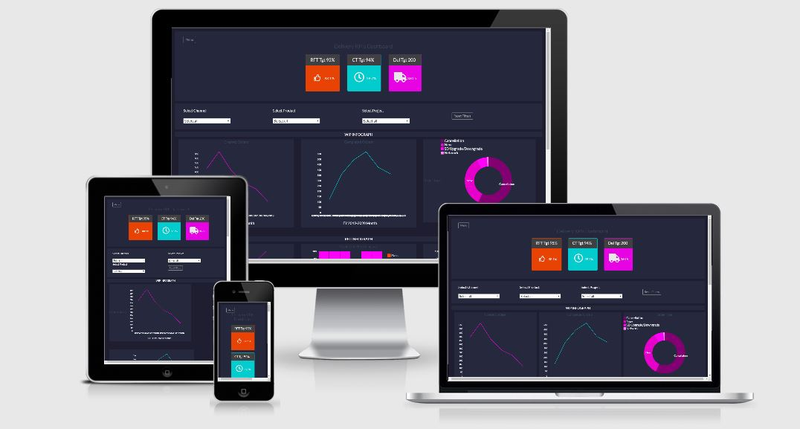
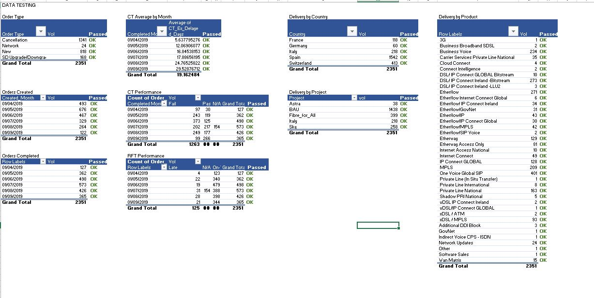

# Delivery Dashboard

The dashboard will be used in the Delivery department to keep track of the KPIs performance throughout the financial year. The dashboard will give a graphic representation of the data analysis allowing interaction between graphs (crossfilter and selectors available) as well as on hover information. The toggle Sidebar one right gives the user the possibility to submit further change requests and the option to download the data source, for those willing to further explore our performance using different tools. The presentation is neat and minimalist to ensure it can be used in PowerPoint presentation across the business.

## UX

The typical user for the project will be a Delivery department manager checking the performance of our KPIs for the year. The dashboard will have to be clean and give a high-level kind of information.

After conducting a series of Voice of the Customers meetings the users' needs have been identified as :

- Be able to check current performance vs KPI target at a glance
- Be able to identify possible issues i.e. which type of Delivery or Product has a low Cycle Time performance, to act on them and start a further analysis, without too much detail cluttering the view
- Be able to interact with the data and reset the filters applied
- Be able to have a source of consistent data across the business to use for presentation and meetings.

A simple sketch wireframe of the project can be found [here](assets/wireframes/wireframe.pdf).

## Features
A live demo of the site can be found [here](https://valenovi76.github.io/Delivery_Dashboard/)

DATA
the data used for the project is a mock-up of the data we currently produce on a SQL database
sensitive information has been scrambled.
The Database will eventually be linked to the dashboard to allow a live representation.
The original file was submitted in CSV but was then converted into JSON

STRUCTURE
The dashboard presents 3 cards for KPIs representation.
They are the most coloured part of the project to ensure they stand out as the main message we want to provide.
The page is then divided into 3 sections for the graphs, according to the different theme they pertain to.
A toggle sidebar menu is accessible on the left-hand side and allows the users to navigate to the Change Request page or to download the CSV data file.

### Existing Features

The  3 cards on the header, represent our Key Performance Indicators, the corresponding target and a live feed from the data to show the current performance.

 - Selectors on the section below allow data filtering across the entire dashboard.
    A sticky JS ensures the filters are fixed on the top of the screen,
    so that they can be changed or reset while checking the graphs further down on the page.
 - A button to reset the graphs is available at the far end of this section.
 - The graphs are structured in 3 segments:
                Work In Progress analysis
                RFT and CT performance (KPIs)
                Product/Project/ Country Deliveries
 - The use of crossfilter throughout the project ensures the graphs are all interacting with each other.
For example, selecting one segment of the Order Type Pie graph will filter accordingly all the other graphs.
 - The dashboard is not mobile responsive because it is built to be used on Computer and Laptop devices. The interaction between the graphs would be lost on a mobile screen (especially phones).

### Features Left to Implement

 -   The dashboard will be linked to the SQL database that provides our data.
 - Further pages will be added to show the performance of our business from a team and user perspective and the dashboard audience will be broaden
 - the Dashboard will be mobile responsive
 

## Technologies Used

- HTML
- CSS
- [Bootstrap](https://getbootstrap.com/)
- [EmailJS](https://www.emailjs.com/) : used to write change requests emails in JavaScript
- [Fontawsome](https://fontawesome.com/)
- JavaScript
- [d3.js](https://d3js.org) v3
- [crossfilter](https://github.com/square/crossfilter)
- [dc.js](https://dc-js.github.io/dc.js/)

##  Testing

Thorough testing was conducted on the data loading via console.log, crossreference against an excel pivot on the same data.
Further testing was conducted to ensure that the crossfilter was properly working across the graphs
A copy of the excel file built to test against the console logs and the crossfilter can be found [here](/assets/data/Data_testing.xlsx).
Please note how the Excel slicers re-create the crossfilter effect as well as the slicers'.
Below a picture of the test on the data load

The Change Request form has been tested as per below process

1.  Contact form:
    1.  Click on the Menu button
    2. Select "Change Requests Log"
    3.  Try to submit the empty: an error message about the required fields appears
    4.  Try to submit the form with an invalid email address: relevant error message appears
    5.  Try to submit the form with all inputs valid: the email is sent

The HTML code and the CSS one were tested via w3org sites and do not throw any error.

## Issues encountered

The biggest issue I experienced was the parsing of the date to create the composite graph on the country deliveries.
I first thought the issue was the CSV file and converted it into JSON.
Then realised the parsed date is returned in a date and time format regardless of the fact the format specified is a different one.
This is also evident on the other graphs, where the field is plucked: the data labels become extremely big and overlap

Stephen at Code Institute helped me fix my composite graph.
The reduce functions were not creating the correct references and the reduceCount wasn't either.  Stephen suggested creating a Sum function for 
the groups and setting the values to 1.
The "+" symbol before the number is forcing the value of the country to become a sum. It is an unusual fix but works. 

Also, the switch to JSON file created an issue with the deployment environment which could not find the data file anymore.
At the end I managed to relink them moving the data folder to a different tree level, matching the file path on the deployment environment.

The labels issue was fixed moving the parser before the crossfilter and actual function right before the make graph for the composite graph.
This way the parser applies only to the graph where it is needed and doesn't affect the pluck for the other graphs.
Thanks to Luca at CodeInstitute for the solution.

## Deployment

This site is hosted using GitHub pages, deployed directly from the master branch.
The deployed site will update automatically upon new commits to the master branch.
For the site to deploy correctly on GitHub pages, the landing page is named index.html, and the current live site can be accessed [here](https://valenovi76.github.io/Delivery_Dashboard/).

## Credits

### Content

- The sidebar menu was implemented following the tutorial from Bucky Roberts. Link to his [GitHub](https://github.com/buckyroberts)
- The contact form for the Change Requests was copied from [Bootstrapius](https://bootstrapious.com/p/how-to-build-a-working-bootstrap-contact-form)
- The graphs codes, as well as the emailjs implementation,  were completed following the tutorials from CodeInstitute FullStack Developer Course. Link to GitHub for graphs
can be found [here](https://github.com/Code-Institute-Solutions/DataVisualisationMiniProject) and the one for the EmailJS can be found [here](https://github.com/Code-Institute-Solutions/InteractiveFrontendDevelopment-Resume)

### Acknowledgements

-   I received inspiration for this project from Damien Meere and Michael O'Farrell, my fellow students at the course.
-   The tutors at CodeInstitute were fundamental in helping me with my issues.
